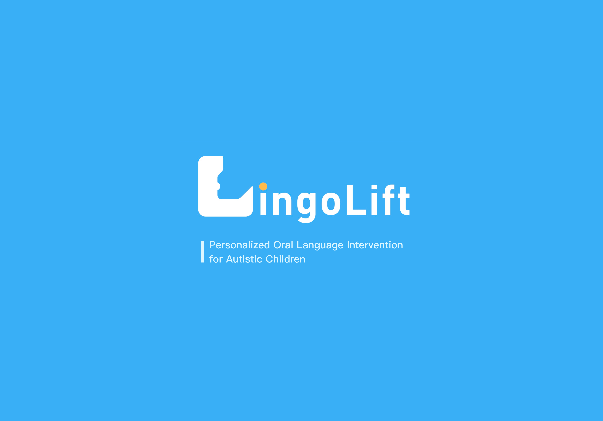

<!-- Language Switch Buttons -->
<p align="right">
  <a href="#english">
    
  </a>
  <a href="#chinese">
    
  </a>
</p>

---

<div id="english">

# LingoLift



## Introduction

LingoLift is an educational system developed by [ARK Lab](https://arkxlab.github.io/index.html) from the Hong Kong University of Science and Technology (Guangzhou), specifically designed for personalized training and teaching for children with autism. Leveraging Large Language Models (LLM), Text-to-Image generation, and Augmented Reality (AR) technologies, LingoLift comprises two main subsystems:

- **Teacher Interface:** Enables educators to create individualized lesson plans and teaching materials.
- **Projection Interface:** Utilizes AR for interactive physical operations and classroom instruction.

## Deployment

Make sure you have installed dependencies and React Native CLI globally:

```bash
# Install dependencies
yarn install

# For iOS
cd ios && pod install && cd ..

# Run on Android
yarn android

# Run on iOS
yarn ios
```

If you encounter issues, ensure your development environment meets [React Native requirements](https://reactnative.dev/docs/environment-setup).

</div>

---

<div id="chinese">

# LingoLift


## 项目简介

LingoLift 是一款由[香港科技大学（广州）ARK Lab](https://arkxlab.github.io/index.html) 为孤独症儿童患者个人训练教学开发的，基于大语言模型（LLM）、文生图和增强现实（AR）技术的教学系统。LingoLift 包含以下两个主要子系统：

- **教师端：** 用于教师创建个性化教案和教学素材。
- **投影端：** 利用AR技术进行实体交互操作和课堂教学。

## 部署运行

确保你已全局安装好依赖和 React Native CLI，运行以下命令启动项目：

```bash
# 安装依赖
yarn install

# iOS 平台需额外运行
cd ios && pod install && cd ..

# 在 Android 上运行
yarn android

# 在 iOS 上运行
yarn ios
```

如遇到任何问题，请确保你的开发环境满足 [React Native 环境要求](https://reactnative.dev/docs/environment-setup)。

</div>
